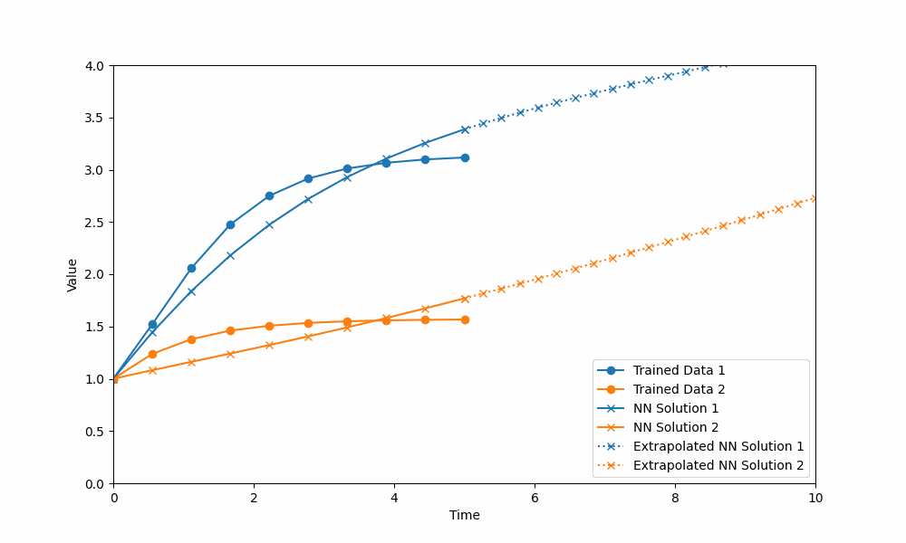

# NODEFit

(https://pepy.tech/project/nodefit)

Fit time-series data with a Neural Differential Equation!

This repository contains time-series data fit capabilities using both Neural Ordinary Differential Equations and Neural Stochastic Differential Equations

GPU support is packaged as part of [PyTorch](https://pytorch.org/)

# How to install and execute?

Tested on Python 3.9

Just run 
```
pip install nodefit
```

The following program illustrates a basic example
```python
import numpy as np
import torch.nn as nn
from nodefit.constants import DEVICE

from nodefit.neural_ode import NeuralODE
from nodefit.neural_sde import NeuralSDE


###
# DEFINE NETWORKS
###

# Neural ODE parameters
ndim, drift_nhidden, diffusion_nhidden = 2, 10, 2

drift_nn = nn.Sequential(
    nn.Linear(ndim+1, drift_nhidden),
    nn.Sigmoid(),
    nn.Linear(drift_nhidden, ndim)
).double().to(DEVICE)

diffusion_nn = nn.Sequential(
    nn.Linear(ndim+1, diffusion_nhidden),
    nn.Sigmoid(),
    nn.Linear(diffusion_nhidden, ndim)
).double().to(DEVICE)

###
# PROVIDE DATA
###

# Training between data for 0 and 5 seconds
t = np.linspace(0, 5, 10)
# Provide data as list of lists with starting condition
data = np.array([[...]])

###
# FIT USING NEURALODE
###
print('Performing fit using Neural ODE...')

neural_ode = NeuralODE(drift_nn, t, data)
neural_ode.train(2000)

# # Extrapolate the training data to 10 seconds
extra_data = neural_ode.extrapolate(10)
neural_ode.plot(extra_data)

###
# FIT USING NEURALSDE
###
print('Performing fit using Neural SDE...')

neural_sde = NeuralSDE(drift_nn, diffusion_nn, t, data)
neural_sde.train(1)

# # Extrapolate the training data to 10 seconds
extra_data = neural_sde.extrapolate(10)
neural_sde.plot(extra_data)

```

## Sample Output




## Whom to contact?

Please direct your queries to [gpavanb1](http://github.com/gpavanb1)
for any questions.

## Acknowledgements

This package would not be possible without the supporting packages - [torchdiffeq](https://github.com/rtqichen/torchdiffeq) and [torchsde](https://github.com/google-research/torchsde)
